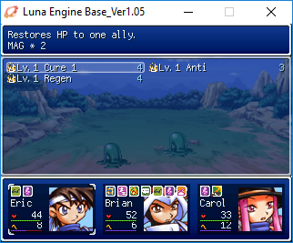

[Join us on Discord!](https://discord.gg/yRUZcdQ)

# [](http://rmex.github.io) [ORMS : Old RPG Maker Style](https://github.com/RMEx/orms/blob/master/orms.rb) v1.1.4
> Make a RM2K(3)-like game with RMVXAce!


***

# Installation

orms holds in one script and two resources (Font.png and Font_color.png)
Check-out the [lastest release!](https://github.com/RMEx/orms/releases/latest)

---

# Configuration

OLD_RM_STYLE is really versatile, see the first module **ORMS_CONFIG** in the script to configure it!
**All the features are optional**, just activate the features you want, deactivate the features you don't, and... *enjoy!*

---

# Features

## BITMAP_FONT

Use the bitmaps **Font** and **Font_color** to draw texts

Image name | Example
--- | ---
Font.png | 
Font_color.png | 

## BITMAP_FONT OPTIONS:
Option | Description | Default value
--- | --- | ---
**FONT_WIDTH<br>FONT HEIGHT** | The character size of your font bitmap | 6 x 14
**DOUBLE_FONT_SIZE** | Double the size of the bitmap font/text | true
**LINE_HEIGHT** | Change the line height | 32
**PADDING** | Change the padding of the message and battle windows | 16
**SHADOW** | Draw text shadow using the last color in "Font_color.png" | true
**REWRITE_ALL_TEXTS** | Rewrite Bitmap.draw_text instead of Window_Base.draw_text | true

## BOX_FEATURES:
Feature | Description | Default value
--- | --- | ---
**OPAQUE_BOX** | Opaque text box if true | false
**STOP_CURSOR_BLINKING** | Stop cursor blinking if true | true
**OLDSCHOOL_CHOICE_LIST** | RM2K(3)-like choice list like if true | true

## SCREEN_FEATURES:
Feature | Description | Default value
--- | --- | ---
**OLD_RESOLUTION** | Just set game resolution to 640*480 (to simulate RM2k(3)'s 320*240) | false
**[NEW!] TOGGLE_FULLSCREEN** | The shortcut (:F3..:F11) to toggle the fullscreen mode like RM2k(3).<br><br>Set the shortcut to 0 if you want none. | :F4
**[NEW!] TOGGLE_WINDOW_MODE** | The shortcut (:F3..:F11) to toggle to TINY 1x WINDOW MODE like RM2k(3).<br><br>Set the shortcut to 0 if you want none. | :F5
**PIXELATE_SCREEN** | If you want fat pixels everywhere!<br><br>This feature is a bit greedy, but it tries to optimize itself with a custom frame skipping method.<br><br>This feature activate a custom FPS display (F2) that shows the real FPS, counting the frame skipping. | false
**[NEW!] PIXELATION_SHORTCUT** | The shortcut (:F3..:F11) to activate/deactivate pixelation ingame.<br><br>Set the shortcut to 0 if you want none.<br><br>Don't forget to tell the player he can use this shortcut! An alternative is to use the `Orms.set(:pixelate_screen, false)` method. | :F6

### NOTE:
**TOGGLE_FULLSCREEN** and **TOGGLE_WINDOW_MODE** re-define also the Fullscreen++ shortcuts if you use it too. If you use Fullscreen++, place Fullscreen++ right before orms!

[Get Fullscreen++](https://forums.rpgmakerweb.com/index.php?threads/fullscreen.14081/)

## RESSOURCES_FEATURES:
Use these features if you want to directly use RM2k(3) ressources!

Feature | Description | Default value
--- | --- | ---
**USE_OLD_RM_BACKDROP** | Battlebacks1/2 auto-resized by two | false
**USE_OLD_RM_MONSTER** | Battlers auto-resized by two | false
**USE_OLD_RM_PANORAMA** | Parallaxes auto-resized by two | false
**USE_OLD_RM_PICTURE** | Pictures auto-resized by two | false
**USE_OLD_RM_TITLE** | Titles1/2 auto-resized by two | false
**USE_OLD_RM_CHARSET** | Characters auto-resized by two | false
**[NEW!] BACKDROP_ALIGN_TOP** | Align Battlebacks to top instead of center (for RM2K backdrops) | false
**KILL_CHARSET_SHIFT_Y** | Does as if all "Characters" had "!" in their name | false
**OLD_CHARSET_DIRECTION** | In VXAce's ressources, directions are "DOWN, LEFT, RIGHT, UP" but in RM2k(3)'s ressources, it's "UP, RIGHT, DOWN, LEFT"<br><br>this fix allows you to use directly charsets from 2k(3)! | false

## DESTROY_NEW_RM_FEATURE:
Feature | Description | Default value
--- | --- | ---
**DEACTIVATE_DASH** | No dash when you press shift if true | false

---

# [NEW!] Ingame methods for users

Method | Description
--- | ---
`Orms.set(feature, false)` | Change the features ingame! Example: `Orms.set(:bitmap_font, false)`
`Orms.deactivate` | Deactivate all the features
`Orms.activate` | Activate all the features

---

# Examples


> Example of the **OLDSCHOOL_CHOICE_LIST** and **TOGGLE_WINDOW_MODE** features


> Example of the **DOUBLE_FONT_SIZE** feature (false)


> Example of the default menu displayed with the **BITMAP_FONT** feature





> Examples of a game using orms and Luna Engine (by **JosephSeraph**)


> Example of a **beautiful customized** bitmap font (by **JosephSeraph**)

---

# HOW TO MAKE YOUR OWN AWESOME BITMAP FONT

The **Font.png** is generated by the awesome tool [Fony](https://fony.en.softonic.com/#app-softonic-review)

For example :

1. load "Bilou2k3.fon" with Fony


2. Use **Edit > resize** to make a smaller font in height


3. Use **Edit > Boldify**... why not?


After that you need to have **all the bottom line transparent** for all the characters, to render the text shadow without trouble after

4. Select all the characters in the right pannel


5. Then press the **"up"** button


**NOTE :** You also need to have **all the right column transparent** for all the characters, to render the text shadow without trouble!

Use the same method as above, but with the **"left"** button!

6. Save your new font, and do **File > Export > Bitmap**, save as "Font.png" in `Graphics/System/`

Then you get A SHINY PERFECT NEW "FONT.PNG" YOU CAN EDIT BACK WITH FONY ULTRA QUICKLY ANYTIME!!


Instead of **6\*14** like RM200(3), this one is **7\*11** (just count the pixels in Fony), you can specify that in my script :

```
# BITMAP_FONT_FEATURE_OPTIONS:
  FONT_WIDTH            = 7     # See BMP Font character's width
  FONT_HEIGHT           = 11    # See BMP Font character's height
```
instead of :
```
# BITMAP_FONT_FEATURE_OPTIONS:
  FONT_WIDTH            = 6     # See BMP Font character's width
  FONT_HEIGHT           = 14    # See BMP Font character's height
```

And since the height is now smaller, you can also reduce the line height :
```
  LINE_HEIGHT           = 24    # Line height: VXAce: 24  2K(3): 32
```

---

# CUSTOM FONT ISSUES WITH FONY

Of course you can edit the font you want with Fony, ".fon" or not. But there is some important things to verify before the bitmap exportation!

* You **must** have a **blank row** at the bottom and a **blank column** at the right:

  

  If not, just **select all the characters** into the right pannel and use the **arrow buttons**.

* In **Edit > Properties** (Ctrl + H), you **must** set the **First char** to 0, the **Last char** to 255, and check **Monospaced**:

  

  **If you get a too wide character width** when you convert the font to **monospaced**, it's because some characters are too wide like W, w, M, m, Æ, æ.
  There is a very simple method to **reduce the width of all characters at one time**:

  

  When you have an accurate monospaced width, you can stretch manually the cropped fonts that were too wide (like W, w, M, m, Æ, æ) by redrawing them.

---

# COMING SOON!

**TODO LIST:**

- [x] **Verify/fix** compatibility between `PIXELATE_SCREEN` and some nervous scripts
    - [x] RME (camera commands)
    - [x] Luna Engine
    - [ ] Theo's Sideview battle system
    - [ ] MGC's mode 7
- [x] **Fix** name input
- [ ] **Fix** current feature status not saved in save files yet
- [ ] **Fix** characters direction in save/load menus (when `OLD_CHARSET_DIRECTION` is used)
- [ ] **Add** the feature `NO_MAP_SHADOWS` in `DESTROY_NEW_RM_FEATURES` to deactivate the VXA shadow display in maps ingame
- [ ] **Extend** `OLD_CHARSET_DIRECTION` behaviour: Will not change the directions of the Characters that the first character of their names is `'@'`.
- [ ] **Implement** `ICONS_FOR_ALL_TEXTS` feature to use the `\I[id]` control character for everything like RM2K(3) did with glyphs ($a..$Z)
- [ ] **Implement** `BITMAP_FONT_FEATURE_OPTIONS`:
    - [ ] **Define** `BITMAP_FONTS = [args_1, args_2, args_3]` option with `args_X` equal to `[name, *char_width, *char_height, *color_set, *nb_color_max, *shadow]`, for instance, `args_1` will be equal to `["Font"]` (The default font name)
    - [ ] **Define** `CURRENT_BMP_FONT`, `DEFAULT_COLOR_SET`, `DEFAULT_FONT_WIDTH`, `DEFAULT_FONT_HEIGHT`, `DEFAULT_SHADOW` options (the last three will replace `FONT_WIDTH`, `FONT_HEIGHT` and `SHADOW`)
    - [ ] **Define** `\F[id]` control character to change the BMP\_FONT in the middle of **any** text
    - [ ] **Extend** `LINE_HEIGHT` behaviour: will be defined by an integer (like now) or the array `[top_margin, bottom_margin]` instead.
    For instance, `LINE_HEIGHT` will be equal to `LINE_HEIGHT[0] + font[:height] + LINE_HEIGHT[1]`).
- [ ] **Implement** RM2k(3)-like **transitions** features and methods that reproduce and extend all transitions behaviours from RM2k(3)! :D
- [ ] **Implement** `OLD_RM_CURSOR` feature (use a second System/Window picture to make oldschool blink like RM2k(3) (graphical switch blinking)) - Will replace the actual `STOP_CURSOR_BLINKING`
- [ ] **Develop** [orms-converter](https://github.com/RMEx/orms-converter)
- [ ] **Sleep**
- [ ] **Any suggestion? ...Bug report?** Feel free to [create an issue](https://github.com/RMEx/orms-converter/issues) or contact me [on Discord!](https://discord.gg/yRUZcdQ)
